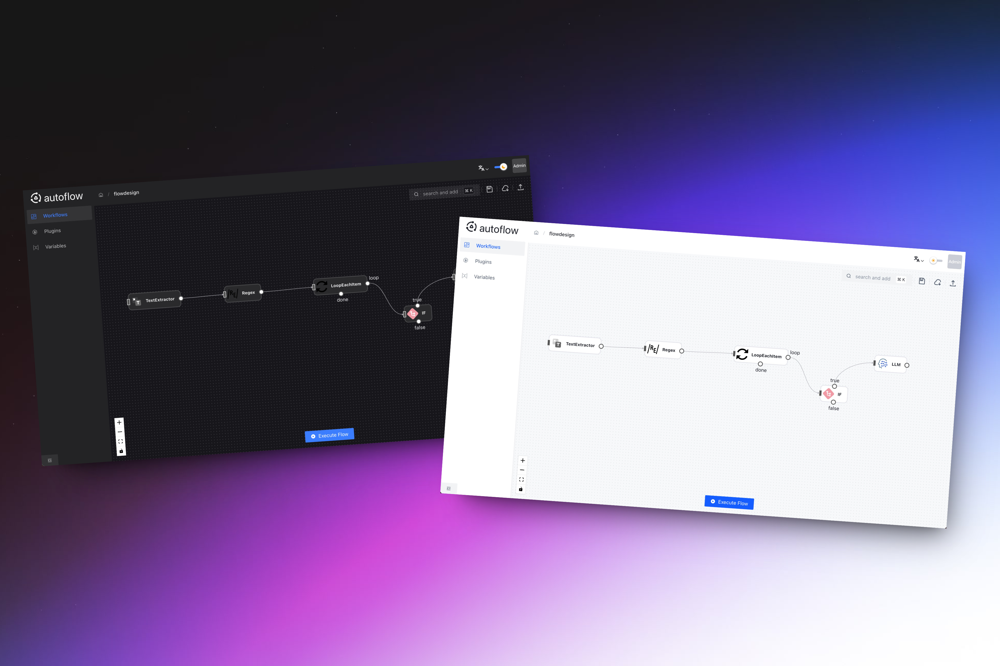

  <h1 align="center">
    autoflow
  </h1>
  

   autoflow 是一个插拔式工作流工具，旨在通过灵活的模块化设计提供高度可定制的工作流编排与调度
  

    

# 特性

- **模块化**：基于SPI机制实现工作流节点的模块化处理，根据需求动态扩展、加载、替换或移除功能模块
- **灵活配置**：支持通过JSON配置文件或管理界面进行工作流的定制
- **基础规则节点**：支持常用的条件、自循环、多节点循环等基础规则节点，适应多样化的流程编排。

# 支持

- 如果这个项目对你有帮助，可以动下小手点下右上角的⭐️star
- 个人的能力有限，有兴趣的朋友可以一起参与进来将系统完善

