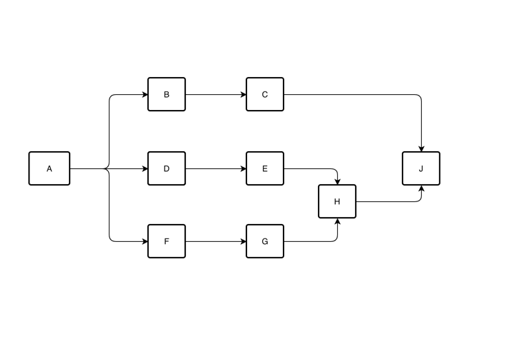

流程图如上，多节点默认为串行

思路：若连线都是单个节点，则直接串行处理，若遇到了多节点，则找到多节点的最近共同交点划分子区域处理

#### 伪代码

```java
public static ELWrapper convertEl(Flow flow){
        List<Node> startNodes=flow.getStartNodes();
        List<ELWrapper> elWrappers=new ArrayList<>();
        while(CollUtil.isNotEmpty(startNodes)){
        //当前流程的起始节点有多个
        if(CollUtil.size(startNodes)>1){
        //当前处理的节点如上图的B、D、F节点为例
        //1.找到他们的共同第一优先交点 --> 这里找到的是J
        Node commoneNode=findCommonNode(startNodes);
        if(commoneNode!=null){
        //2.以当前的多节点为起点，J之前的节点为终点  构建一个新的子流程
        Flow subflow=new Flow();
        elWrappers.add(convert(subflow));
        //3. 将J定义为下一个起始点
        startNodes=List.of(commoneNode);
        }else{
        //4.若找不到共同交点,则默认交点为结束交点，证明他们都是可独立的子流程（独立域）
        //5.构建出他们的自己的子流程实例			
        List<Flow> subFlows=createSubFlows(startNodes);
        List<ELWrapper> whenElList=subFlows.map(flow->convertEl(flow)).toList();
        elWrappers.add(toWhenEl(whenElList));
        //6.将startNodes定义为null 结束构建
        startNodes=null;
        }

        }else{
        //单个节点的处理
        Node cuurentNode=startNodes.get(0);
        elWrappers.add(处理单个节点的EL(cuurentNode));
        //将起始节点指向当前节点的下一批节点  如上图的A节点，则下批节点为B、D、F
        startNodes=cuurentNode.getNextNodes();
        }
        }
        return thenEls(elWrappers);
        }
```
